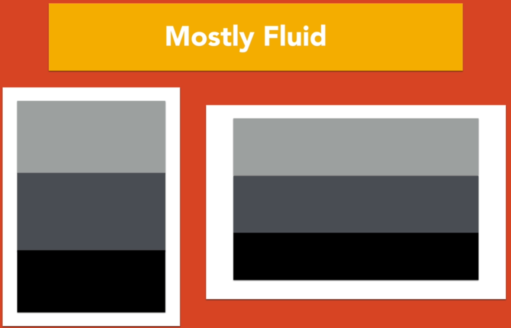

# Practica de CSS usando GRID y FLEXBOX 

### Utilizando diferentes tipos de diseños

    ire creando las carpetas con el contenido a utilizar predefinido

## Detalles de Flexbox

- "GAP:" para separacion de columnas no tiene soporte al 100%- RELATIVAMENTE NUEVO
en cambio
- "FLEX: 0 0 calc()" Tiene soporte al 100%
- Cuando usemos un "Calc()" es muy posible que necesitemos usar un "space-beetwen"

### Column-Drop

### Sidebar

 

### Layout Shifter

## Concepto de Tiny Tweaks (pequeños ajustes)

    Son pequeños cambios/ajuste en ciertos elementos, no cambia tanto el diseño, lo demas elementos "fluyen" en los codigo segun la "resolucion" o segun la situcion en el css

~~~
Como su nombre indica, este es uno de los patrones de layout para diseño responsive y determina que la mejor manera de modificar nuestra página web no es mediante la posición de los bloques ni los grandes elementos, sino mediante la realización de pequeños cambios en el diseño.
~~~

## Mostly Fluid

<aside>
💡 El contenido simplemente fluye sobre el espacio disponible, varia el espacio de margenes del lado izquierdo y derecho.

El patrón Mostly fluid **consiste, principalmente, en una cuadrícula fluida**. Por lo general, en las pantallas grandes o medianas se mantiene el mismo tamaño y simplemente se ajustan los márgenes en las más anchas.

Por ejemplo no es recomendable usar medidas fijas para ciertos elementos o imagenes.

</aside>